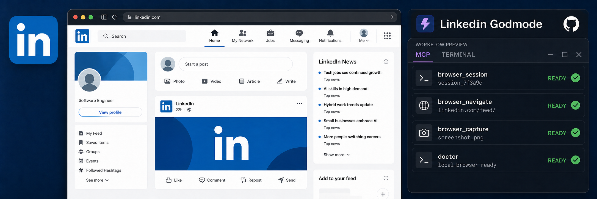
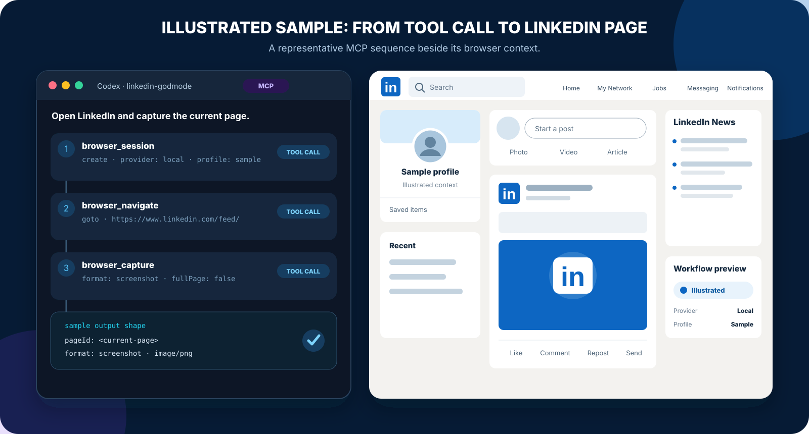
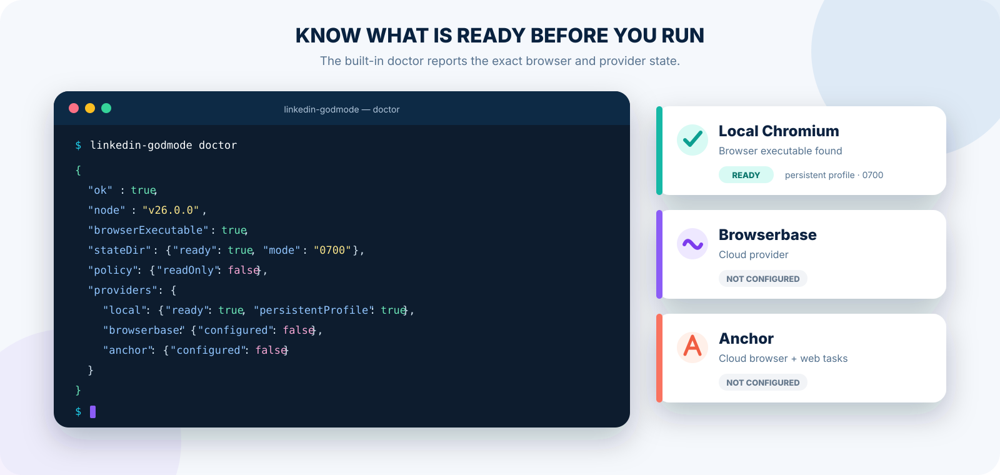

<p align="center">
  
</p>

<h1 align="center">LinkedIn Godmode</h1>

<p align="center">
  <strong>One browser automation core. MCP, CLI, HTTP, local Chromium/Chrome, or cloud browsers.</strong>
</p>

<p align="center">
  <a href="https://www.npmjs.com/package/linkedin-godmode"></a>
  
  <a href="LICENSE"></a>
</p>

<p align="center">
  <a href="#quick-start">Quick start</a> ·
  <a href="#generic-tool-surface">Tools</a> ·
  <a href="#providers">Providers</a> ·
  <a href="#browser-examples">Examples</a> ·
  <a href="#development-and-verification">Verification</a>
</p>

LinkedIn Godmode is a Codex plugin, npm CLI, and MCP stdio server that gives an agent broad **generic** browser and HTTP primitives for operating a personal LinkedIn session. The caller supplies URLs, locators, JavaScript, HTTP endpoints, payloads, and explicit task prompts—the package does not encode LinkedIn business actions or mutable private endpoints.

The same TypeScript core powers MCP, one-shot CLI commands, JSON runs, and JSONL batches. Deterministic browser and HTTP operations do not call an AI model. `browser_task` is the only AI-capable operation and runs only when explicitly invoked.

<table>
  <tr>
    <td width="33%" valign="top"><strong>LinkedIn in the browser</strong><br />Navigate, locate, act, evaluate, capture, and inspect network traffic through one generic surface.</td>
    <td width="33%" valign="top"><strong>Capture-first</strong><br />Observe the browser request, replay the minimum HTTP shape, then verify the result at the layer that matters.</td>
    <td width="33%" valign="top"><strong>Run anywhere</strong><br />Use a dedicated local Chromium/Chrome profile, Browserbase, or Anchor without changing the core tool model.</td>
  </tr>
</table>

## See the MCP workflow

<p align="center">
  
</p>

## Requirements

- Node.js 20.11 or newer
- Playwright Chromium, installed explicitly with the package-owned `install-browser` command
- For cloud providers, the corresponding environment variables
- A LinkedIn account you are authorized to operate

## Quick start

Install from npm and run the environment doctor:

```bash
npm install --global linkedin-godmode@0.1.1
linkedin-godmode install-browser
linkedin-godmode doctor
```

<p align="center">
  
</p>

From this source checkout:

```bash
npm ci
npm run build
npm link
linkedin-godmode install-browser
linkedin-godmode doctor
```

Run without a global install:

```bash
npx -y linkedin-godmode@0.1.1 install-browser
npx -y linkedin-godmode@0.1.1 doctor
```

`install-browser` runs the Chromium installer bundled with this exact package version. Optional upstream flags must follow `--`, for example `linkedin-godmode install-browser -- --dry-run`.

### Codex MCP installation

The packaged Codex plugin declares `.mcp.json` and five skills. For direct Codex CLI use, install the npm MCP server:

```bash
npx -y linkedin-godmode@0.1.1 install-browser
codex mcp add linkedin-godmode -- npx -y linkedin-godmode@0.1.1 mcp
```

For a source checkout:

```bash
codex mcp add linkedin-godmode -- node /absolute/path/to/linkedin-godmode-plugin/dist/cli.js mcp
```

Equivalent client configuration:

```json
{
  "mcpServers": {
    "linkedin-godmode": {
      "command": "npx",
      "args": ["-y", "linkedin-godmode@0.1.1", "mcp"],
      "env": {
        "LINKEDIN_GODMODE_DEFAULT_PROVIDER": "local"
      }
    }
  }
}
```

Never place provider keys directly in a checked-in MCP configuration. Inherit them from the process environment or a secure secret manager.

## Generic tool surface

| Tool | Capability |
|---|---|
| `browser_session` | Create/attach/list/status/close sessions; create/list/close pages |
| `browser_navigate` | Goto, back, forward, reload |
| `browser_act` | Generic CSS/role/text/label/placeholder/test-ID/XPath locator actions |
| `browser_evaluate` | Explicit caller-provided JavaScript with a JSON argument |
| `browser_capture` | Screenshot, HTML, accessibility snapshot, or visible text |
| `browser_network` | Start/read/clear/stop bounded request/response capture; bodies opt in |
| `http_request` | Any valid HTTP method token with JSON/text/base64/URL-encoded/multipart bodies |
| `browser_task` | Explicit Anchor or Browserbase hosted task call |
| `doctor` | Redacted runtime and provider readiness |

There are deliberately no tools named for messaging, jobs, invitations, reactions, posting, profiles, campaigns, or any other LinkedIn business action.

## Providers

| Provider | Best for | Connection | Persistence |
|---|---|---|---|
| **Local Chromium/Chrome** | Personal, visible browser sessions | Playwright | Dedicated local profile |
| **Browserbase** | Remote browser infrastructure | CDP | Browserbase Context |
| **Anchor Browser** | Remote sessions and explicit web tasks | CDP + task API | Anchor profile |

### Local Playwright persistent Chromium/Chrome

Local is the default and uses the package's Playwright Chromium build. Set `LINKEDIN_GODMODE_CHROME_CHANNEL` only when you intentionally want an installed Chrome channel. Each profile is stored under:

```text
~/.local/state/linkedin-godmode/profiles/<profile>
```

The directory is forced to mode `0700`. It is a dedicated profile and is never your normal Chrome profile. For a manual login, start an interactive batch and leave its stdin open:

```bash
linkedin-godmode batch -
```

Paste this line and press Enter:

```json
{"id":"login","tool":"browser_session","arguments":{"operation":"create","sessionId":"personal","provider":"local","profile":"personal","headless":false,"initialUrl":"https://www.linkedin.com/"}}
```

Log in in the open browser while the batch process continues waiting for another line. When finished, paste the following line, press Enter, then send EOF with Ctrl-D:

```json
{"id":"close","tool":"browser_session","arguments":{"operation":"close","sessionId":"personal"}}
```

A one-shot `session` command closes immediately after returning and therefore cannot host an interactive login. Persistent profiles retain cookies and other authenticated browser storage on disk, but the plugin does not separately export, log, or return them. Treat the entire profile directory as a credential, exclude it from sync/backups, and delete it when no longer needed.

### Browserbase

```bash
export BROWSERBASE_API_KEY='...'
export BROWSERBASE_PROJECT_ID='...'
```

The implementation pins official `@browserbasehq/sdk` 2.16.0, creates sessions with zero SDK retries, propagates configured allowed domains, and attaches Playwright through the returned CDP URL. `keepAlive:true` with no supplied context creates a Browserbase Context; supply a context ID through `persistentRef` or a non-secret config alias to reuse one. Closing an attached session disconnects this process without releasing the cloud session; pass `terminate:true` to `browser_session close` to terminate it explicitly. Sessions created by this process are owned and released on close.

Browserbase Agents/Runs support `task`, `agentId`, `resultSchema`, `variables`, and an optional persistent context. The current 2.16.0 run schema does **not** expose a caller-selected model/provider or step settings. Supplying those options returns typed `UNSUPPORTED` rather than silently ignoring them.

### Anchor Browser

```bash
export ANCHOR_API_KEY='...'
```

The implementation pins official `anchorbrowser` 1.0.0, calls `Sessions.createSession`/`deleteSession`, and connects Playwright over the provider CDP session. `persistentRef` is passed as the Anchor profile name with persistence enabled.

Explicit tasks call the official `Tools.performWebTask` endpoint. The caller may supply `agent`, `providerName`, `model`, `maxSteps`, element detection/highlighting, human intervention, a URL, and an output schema. Async calls return a workflow ID for `browser_task` status polling.

Anchor attachments follow the same lifecycle rule: local disconnect by default, explicit `terminate:true` to delete an attached cloud session, while owned sessions are deleted on close. Anchor and Browserbase code paths are covered with request-shape mocks. This release does **not** claim live cloud validation unless you run it with your own credentials and report the result.

## Direct CLI and no-AI mode

Every one-shot command accepts one JSON object:

```bash
linkedin-godmode call doctor '{}'
linkedin-godmode session '{"operation":"list"}'
linkedin-godmode http '{"url":"https://example.com/","method":"GET","responseType":"text"}'
```

Named aliases are `session`, `http`, `navigate`, `act`, `evaluate`, `capture`, `network`, and `task`.

### Deterministic JSONL batch

`batch` reads one command per line and writes exactly one result per non-empty line. It processes lines sequentially in one process, so sessions and pages stay alive across steps. No AI is used unless a line explicitly names `browser_task`.

```jsonl
{"id":"open","tool":"browser_session","arguments":{"operation":"create","sessionId":"demo","provider":"local","profile":"demo","headless":true}}
{"id":"goto","tool":"browser_navigate","arguments":{"sessionId":"demo","operation":"goto","url":"https://example.com/"}}
{"id":"capture","tool":"browser_capture","arguments":{"sessionId":"demo","format":"text"}}
{"id":"close","tool":"browser_session","arguments":{"operation":"close","sessionId":"demo"}}
```

```bash
linkedin-godmode batch commands.jsonl
# or
cat commands.jsonl | linkedin-godmode batch -
```

`run` accepts the same command objects as an array or under `{"steps": [...]}` and emits one JSON array:

```bash
linkedin-godmode run commands.json
```

## Browser examples

Create a page and use an accessible locator:

```json
{"operation":"page_create","sessionId":"personal","url":"https://www.linkedin.com/"}
```

```json
{
  "sessionId":"personal",
  "action":"click",
  "locator":{"kind":"role","value":"button","name":"Search"}
}
```

Explicit evaluation executes the body of an async function. Use `return` for a result:

```json
{"sessionId":"personal","source":"return { title: document.title, input: arg };","arg":{"source":"cli"}}
```

Network capture omits bodies by default:

```json
{"operation":"start","sessionId":"personal","includeBodies":false}
```

Set `includeBodies:true` only for a narrow capture. Per-body, aggregate-byte, pending-work, and total-entry caps still apply; bodies with no trustworthy bounded size may be omitted, and cookie and authorization headers are removed.

## HTTP and capture-first request replay

`http_request` uses a byte-capped streaming Node request. When `sessionId` is present, destination-scoped cookies are read from that browser context's cookie jar in memory and recomputed for every redirect hop. Literal `Cookie` headers are always rejected and raw cookies are never returned.

The optional LinkedIn preset is intentionally narrow:

```json
{
  "url":"https://www.linkedin.com/<captured-path>",
  "method":"GET",
  "sessionId":"personal",
  "linkedinWebPreset":true,
  "responseType":"json"
}
```

It verifies a LinkedIn hostname, reads `JSESSIONID` from the browser context in memory, strips surrounding quotes, and adds `csrf-token`. It does not hardcode endpoints, query IDs, payloads, or decorations. Capture the current request in the browser, minimize it, replay it, and verify at the browser/API layer that actually matters.

Request bodies use one of:

```json
{"type":"json","value":{"generic":"payload"}}
{"type":"text","value":"plain text"}
{"type":"base64","value":"AAEC"}
{"type":"form","fields":{"q":"value","tag":["one","two"]}}
{"type":"multipart","fields":{"title":"text"},"files":[{"field":"file","dataBase64":"AAEC","filename":"data.bin","contentType":"application/octet-stream"}]}
```

Responses may be `auto`, `json`, `text`, `base64`, or `none`. Requests do not retry writes implicitly. Redirects are followed manually with host-policy checks on every hop.

## Explicit provider task examples

Anchor with model selection:

```json
{
  "operation":"run",
  "provider":"anchor",
  "task":"Inspect the current page and return its main headings.",
  "sessionId":"anchor-session",
  "agent":"openai-cua",
  "providerName":"openai",
  "model":"gpt-5.4",
  "maxSteps":20,
  "resultSchema":{"type":"object","properties":{"headings":{"type":"array","items":{"type":"string"}}}}
}
```

Browserbase managed run:

```json
{
  "operation":"run",
  "provider":"browserbase",
  "task":"Open the supplied public page and return its title.",
  "resultSchema":{"type":"object","properties":{"title":{"type":"string"}}}
}
```

No local model is installed or invoked. Provider tasks may consume provider credits and may perform page actions; invoke them only with an explicit reviewed prompt.

## Configuration

Default config file:

```text
~/.config/linkedin-godmode/config.json
```

Example (non-secrets only):

```json
{
  "defaultProvider":"local",
  "defaultSession":"personal",
  "readOnly":false,
  "hostAllowlist":["linkedin.com","*.linkedin.com"],
  "timeoutMs":30000,
  "maxOutputBytes":1000000,
  "maxResponseBytes":1000000,
  "aliases":{
    "browserbaseContexts":{"personal":"non-secret-context-id"},
    "anchorProfiles":{"personal":"linkedin-personal"}
  },
  "browserbase":{"projectId":"non-secret-project-id","region":"eu-central-1"},
  "anchor":{"baseUrl":"https://api.anchorbrowser.io"}
}
```

Environment overrides:

- `ANCHOR_API_KEY` (also accepts the official SDK's `ANCHORBROWSER_API_KEY` fallback)
- `BROWSERBASE_API_KEY`
- `BROWSERBASE_PROJECT_ID`
- `LINKEDIN_GODMODE_CONFIG`
- `LINKEDIN_GODMODE_STATE_DIR`
- `LINKEDIN_GODMODE_PROFILE_DIR`
- `LINKEDIN_GODMODE_DEFAULT_PROVIDER`
- `LINKEDIN_GODMODE_DEFAULT_SESSION`
- `LINKEDIN_GODMODE_HEADLESS`
- `LINKEDIN_GODMODE_CHROME_CHANNEL`
- `LINKEDIN_GODMODE_READ_ONLY`
- `LINKEDIN_GODMODE_HOST_ALLOWLIST` (comma-separated)
- `LINKEDIN_GODMODE_TIMEOUT_MS`
- `LINKEDIN_GODMODE_MAX_OUTPUT_BYTES`
- `LINKEDIN_GODMODE_MAX_RESPONSE_BYTES`
- `LINKEDIN_GODMODE_BROWSERBASE_BASE_URL`
- `LINKEDIN_GODMODE_ANCHOR_BASE_URL`

Configuration files are strict and reject unknown keys. They contain aliases/defaults/IDs, never API keys, cookie values, authorization headers, or CDP URLs.

## Security, safety, and Terms of Service

This tool can make account-visible changes when an agent invokes generic actions or mutating HTTP requests. LinkedIn may restrict automation and private web APIs under its Terms of Service, and automated behavior can trigger limits, challenges, account restrictions, or data-protection obligations. Use only on an account you control, at human-scale rates, with explicit intent and visible verification. Prefer supported official APIs where they meet the requirement.

This package does not provide campaign automation, schedulers, rate-evasion, challenge bypass, cookie-file import/export, or hidden autonomous loops. It does not solve CAPTCHAs locally. Cloud-provider capabilities are governed by their own services and your configuration.

Use `LINKEDIN_GODMODE_READ_ONLY=1` for inspection. It blocks mutating HTTP methods, mutating locator actions, JavaScript evaluation, and hosted tasks. A host allowlist restricts browser main-frame routing (including links, popups, history/reload, initial/page creation, and redirects) plus every HTTP redirect. Read [SECURITY.md](SECURITY.md) and the bundled safety skill before production use.

## Development and verification

```bash
npm ci
npm run build
npm test
npm audit
npm pack --dry-run
npm run test:consumer
```

The integration suite starts a local fixture server and a package Chromium instance, proves persistent local storage across profile reopen, and exercises navigation, actions, JavaScript, captures, network recording, HTTP, and teardown. It skips only when Playwright reports that no browser executable exists.

## Publish to npm

Publish a new version only from the authoritative clean source repository. Confirm that the intended version is absent before publishing it:

```bash
npm login
npm whoami
npm view linkedin-godmode@<new-version> version
npm ci
npm run check
npm run test:package
npm run test:consumer
npm audit
npm pack --dry-run
npm publish --access public
```

After publication:

```bash
npx -y linkedin-godmode@0.1.1 install-browser
npx -y linkedin-godmode@0.1.1 doctor
npm view linkedin-godmode@0.1.1 dist.integrity
```

Do not publish from a generated tarball, a parent monorepo, or a directory containing browser profiles or credentials.

## Provider API evidence

Implementation was checked against official package source and docs on 2026-08-11:

- Browserbase Node SDK 2.16.0: sessions, contexts, and Agents/Runs
- Anchor Browser TypeScript SDK 1.0.0: sessions, CDP helper, and `Tools.performWebTask`
- Model Context Protocol TypeScript SDK 1.30.0
- Playwright 1.62.1

Provider APIs evolve. The lockfile is authoritative for this release. Re-verify official SDK types and request-shape tests before upgrading.
